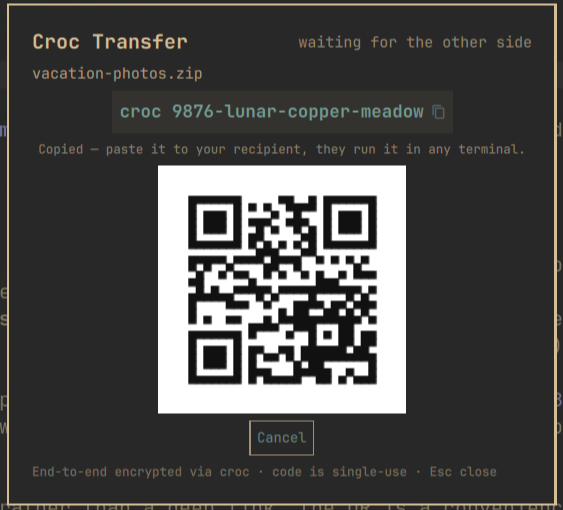

# Croc Transfer for Omarchy

Send a file to anyone, anywhere, without touching a terminal: drop it on
the bar, paste the short code to your recipient, done. Powered by
[croc](https://github.com/schollz/croc) — end-to-end encrypted (PAKE), no
accounts, no shared network, resumable, and the recipient can be on
Linux, macOS, or Windows. Receiving works the same way in reverse: paste
a code, the file lands in `~/Downloads`.



This is the third leg Omarchy was missing: `omarchy share` covers the
same LAN (LocalSend) and Taildrop covers your own tailnet — this covers
*another person, anywhere on the internet*.

## Install

> **⚠️ croc is required and must be installed first.** This plugin is a
> front-end for the `croc` command-line tool — nothing can be sent or
> received without it. It's in the official Arch repos and is the only
> dependency you need to install (`wl-clipboard` and `qrencode` already
> ship with Omarchy).

Requires Omarchy 4.x (Quattro):

```bash
sudo pacman -S croc
omarchy plugin add https://github.com/alexdont/croc-transfer.git --enable
```

If croc is missing, the plugin doesn't break — the card and every send or
receive attempt tell you exactly what to install, and it starts working
the moment croc is present (no restart needed).

Optional keybindings (add to `~/.config/hypr/bindings.lua`):

```lua
o.bind("SUPER + ALT + S", "Croc: pick & send", "omarchy-shell croctransfer pick")
o.bind("SUPER + ALT + R", "Croc transfer", "omarchy-shell croctransfer toggle")
```

## Use

**Send** — drop files or a folder onto the bar icon 󰒊 (or onto the open
card, or click **Pick files…**). The moment croc is ready, the
paste-ready command — `croc lion-brave-sunset` — is on your clipboard and
a toast shows it; paste it to your recipient over any channel and they
run it in any terminal. Clicking the toast reopens the card, which shows
the code, a scannable QR of the command, live progress, and **Cancel**.
The bar icon tracks state: `···` while waiting, a percentage while bytes
move.

**Receive** — click the bar icon, paste the code someone sent you into
the receive field (a full `croc xyz` paste works too), hit Enter. Files
land in `~/Downloads`. A receive that finds no sender gives up after five
minutes.

One transfer runs at a time; starting another tells you so instead of
silently doing nothing. IPC for scripting:
`omarchy-shell croctransfer pick | toggle | send <path> | receive <code> | cancel | status`
(`status` returns state as JSON).

## Custom relay

By default croc meets through its public relay, which only ever carries
end-to-end encrypted traffic and never sees filenames or contents. If you
run your own relay:

```bash
omarchy bar set io.github.alexdont.croc-transfer relay "myrelay.example.com:9009"
```

(The setting is declared in the widget's manifest schema, so it will also
appear in the shell's widget-settings UI as that lands.)

## Security notes

- End-to-end encrypted by croc (PAKE): the relay — public or yours —
  relays ciphertext only.
- The code phrase is single-use: whoever redeems it first gets the file,
  so share it over a channel you trust, and Cancel revokes a pending send
  at any time.
- The receive code is handed to croc via the `CROC_SECRET` environment
  variable (croc's own recommended form), not argv.
- The plugin keeps **no state and no transfer history** — a transfer's
  only record is its notification. Codes live in memory (and your
  clipboard) for the transfer's lifetime, and the plugin never writes a
  state or log file of its own.
- **Received files land in `~/Downloads`, nothing else.** The plugin runs
  croc with `~/Downloads` as the working directory and never executes what
  arrives. croc itself refuses malicious sender filenames — path traversal
  and symlinks that point outside the transfer are rejected (verified
  against croc 11.x: an escaping symlink aborts the receive with "refusing
  files"). Only accept codes from people you trust, since a very large
  transfer will fill your disk like any download.
- The plugin passes every external value — file paths, the receive code,
  a custom relay — to croc as separate arguments, never spliced into a
  shell string; the code is additionally restricted to letters, digits,
  and dashes.
- This plugin does not ship its own browser/web receive bridge: that would
  mean a server holding decrypted files, breaking the end-to-end claim.
  (croc upstream offers its own web helper; that's croc's, not this
  plugin's, and this plugin never routes your files through it.)

## Remove

```bash
omarchy plugin remove io.github.alexdont.croc-transfer
```

Nothing else to clean up — the plugin writes no state.

## License

MIT
